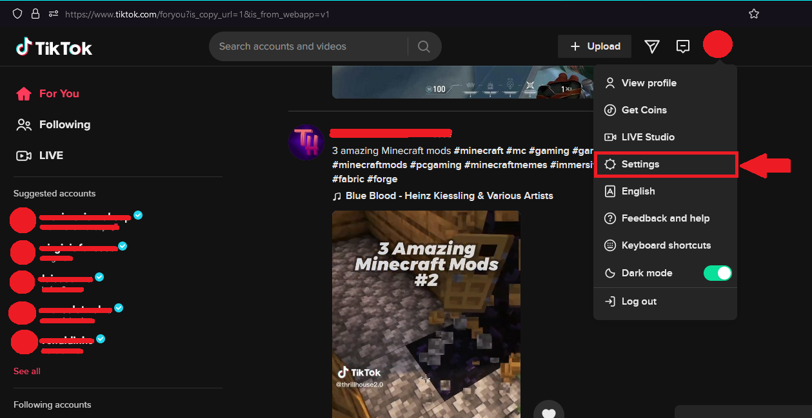
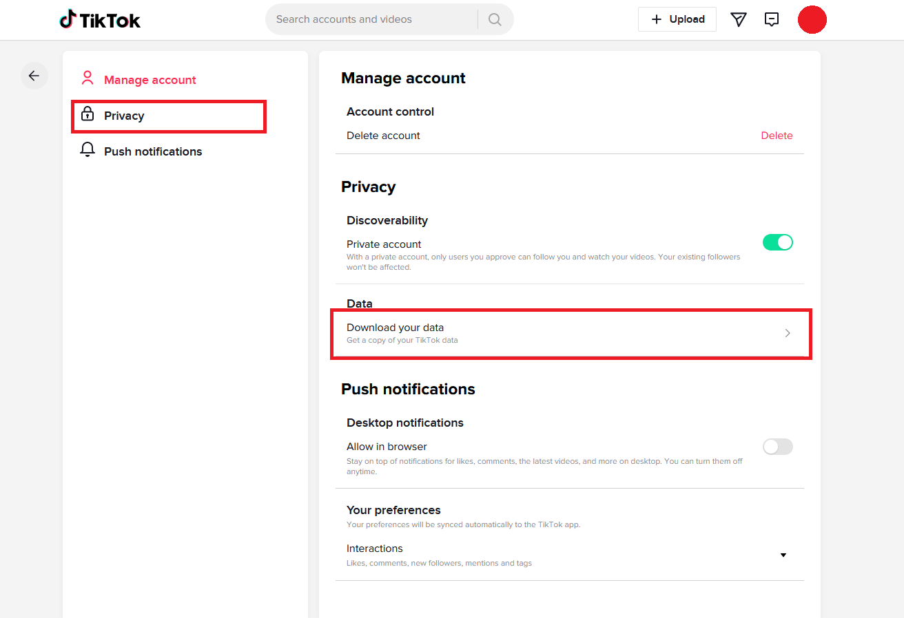
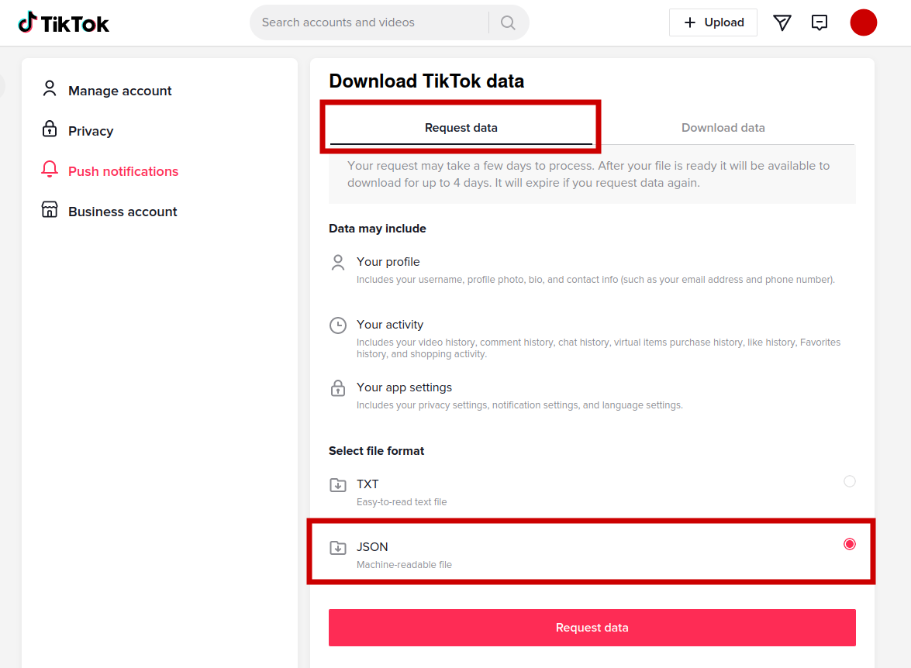
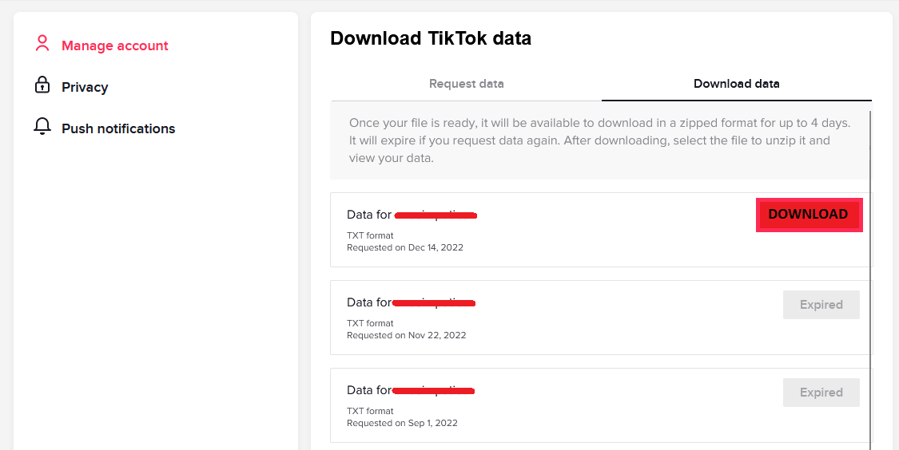
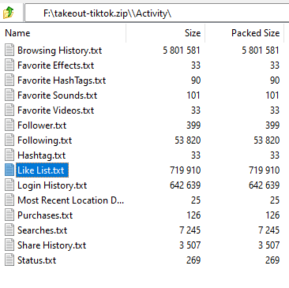

## How to get your `user_data.json` file:

#

### 1. With TikTok open in your web browser, go to Settings

### 2. Go to "Download your data"

### 3. Select `JSON` as the file format and request your data. This process might take a couple days. You'll be notified once it's ready to download.

### 4. Once the download is available, download the file and extract it. 

### 5. Your liked videos will be inside the compressed file. Extract the file to the software folder.

